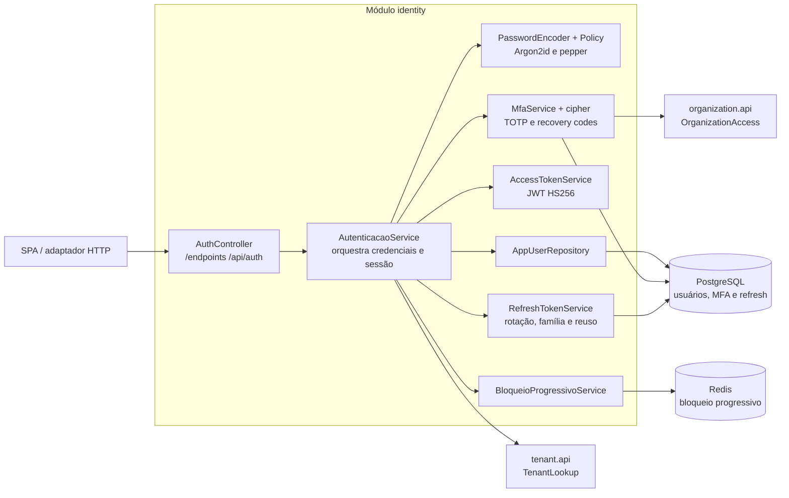

# C4 — Componentes do módulo de identidade

Verificado em 2026-08-05.

O access token sai no corpo e permanece apenas em memória na SPA. O refresh
fica em cookie `HttpOnly`, `SameSite=Strict`, restrito a `/api/auth`. O módulo
usa somente as interfaces públicas de `tenant` e `organization`; nenhum
`internal` externo é importado.

Fontes: `AuthController`, `AutenticacaoService`, `MfaService`,
`RefreshTokenService`, `BloqueioProgressivoService` e `AuthContext.tsx`.

