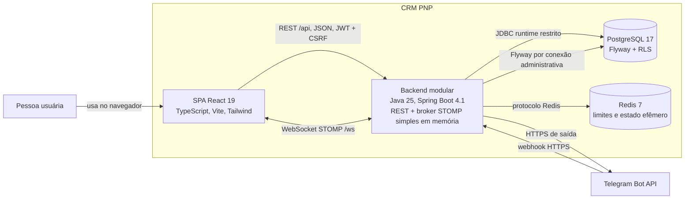

# C4 — Containers

Verificado em 2026-08-05.

O Compose local executa backend, PostgreSQL e Redis. A SPA roda pelo Vite no
desenvolvimento e produz artefatos estáticos no build; o servidor de produção
que os publicará não está definido aqui. O broker em memória impede escala
horizontal segura e é objeto do Prompt 28 — RabbitMQ ainda não é container do
sistema.

Fontes: `docker-compose.yml`, `backend/pom.xml`, `frontend/package.json`,
`frontend/vite.config.ts`, `DataSourceConfig` e `WebSocketConfig`.
