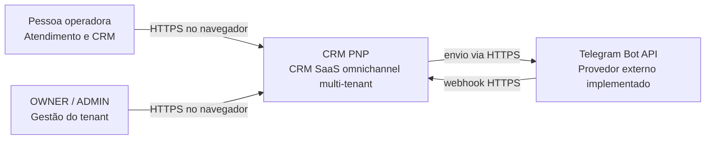

# C4 — Contexto do sistema

Verificado em 2026-08-05.

O sistema oferece contatos, tarefas, funil, relatórios e caixa de entrada. A
integração externa executável hoje é Telegram; outros canais pertencem à
evolução do produto e não são representados como concluídos.

Fontes: `contexto/00-projeto.md`, `TelegramWebhookController`,
`TelegramAdapter` e `LiveChatAdapter`.

