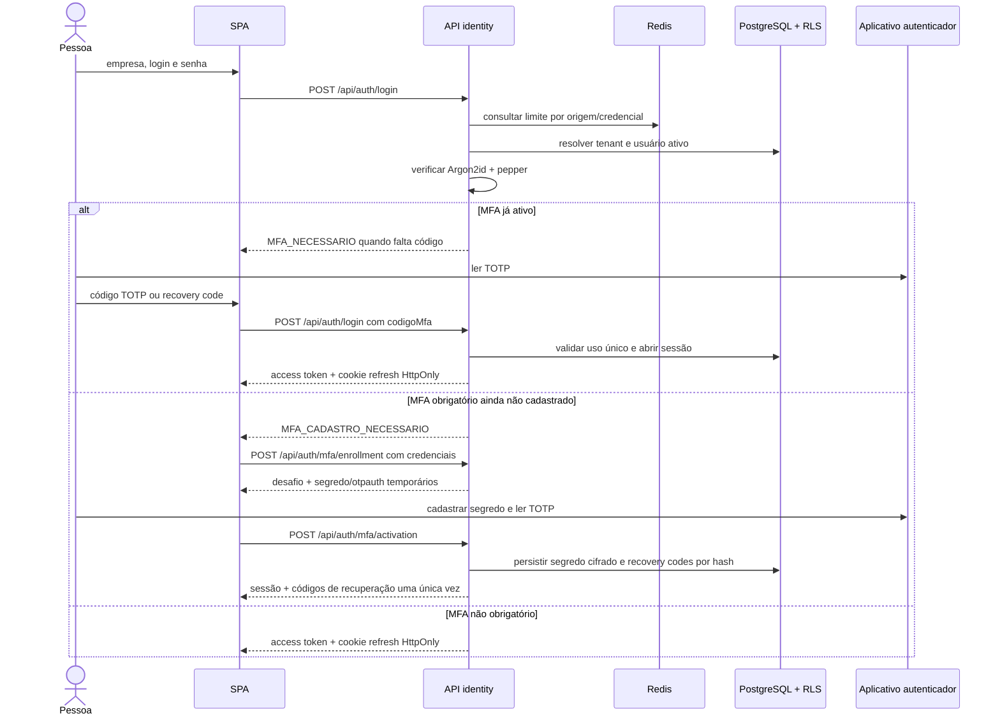

# Sequência — Login e primeiro cadastro de MFA

Verificado em 2026-08-05.

Erros de credencial não revelam se empresa ou login existem. O tenant é
resolvido no servidor e não é aceito como identificador interno enviado pelo
cliente.
