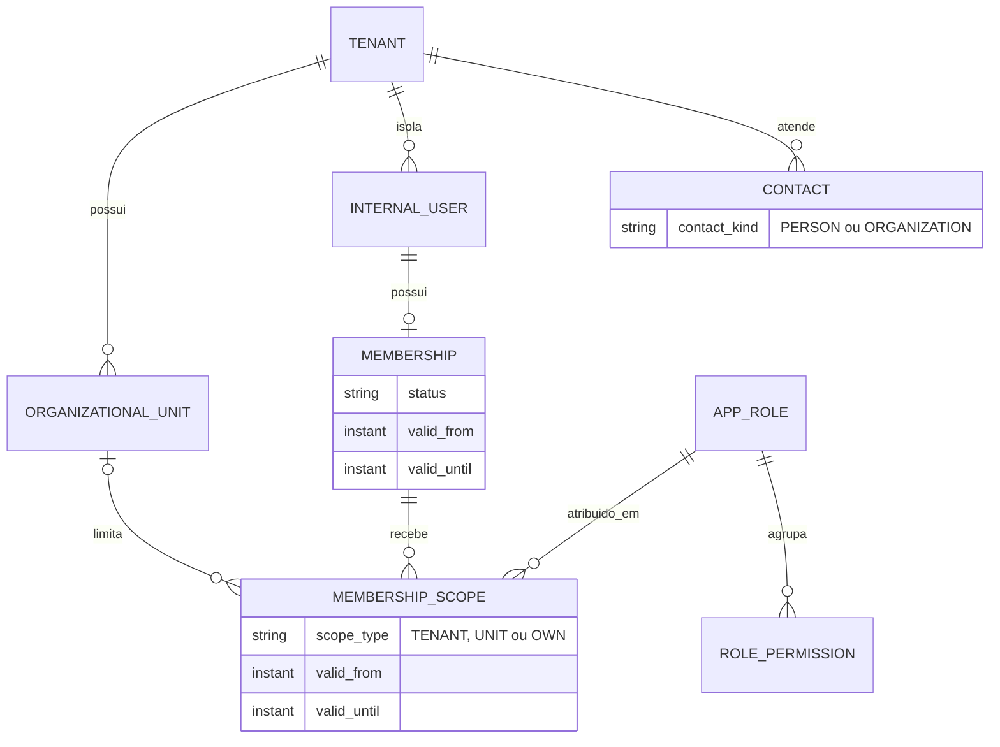

# Modelo organizacional e escopos

## Relações

Um usuário interno tem uma identidade por tenant e no máximo uma membership
não excluída. A membership pode ter várias atribuições `UNIT`; assim duas
unidades não criam duas identidades. Um papel `TENANT` alcança unidades atuais e
futuras do mesmo tenant. `OWN` é predicado de registro e não vira contexto no
seletor.

## Propriedade, cardinalidade e ciclo de vida

| Tipo | Propriedade e cardinalidade | Ciclo de vida | Exclusão |
|---|---|---|---|
| Tenant | raiz; possui N unidades, usuários, contatos e papéis | ativo/inativo | lógica; expurgo por política |
| Unit | pertence a 1 tenant | ativa/inativa | lógica; vínculos históricos permanecem |
| InternalUser | pertence a 1 tenant; não é contato | ativo/inativo | lógica; auditoria preserva o id |
| Contact/Customer | pertence a 1 tenant; `PERSON` ou `ORGANIZATION` | CRM independente de login | lógica; conversas/negócios permanecem |
| Membership | 1 por usuário/tenant; N escopos | ativa, suspensa ou revogada e com vigência | lógica; revogação não apaga histórico |
| Role | pertence a 1 tenant; N permissões e atribuições | ativo/inativo | lógica |
| Scope assignment | pertence a 1 membership e 1 role; unidade só em `UNIT` | ativa, suspensa ou revogada e com vigência | lógica |

Todas as referências carregam `tenant_id` em FKs compostas e todas as tabelas
organizacionais usam RLS forçado.

## Hierarquia de escopo

`NETWORK > TENANT > UNIT > TEAM > OWN` é o vocabulário completo. Nesta etapa:

- `TENANT`, `UNIT` e `OWN` têm persistência e integridade;
- `NETWORK` fica reservado à futura identidade de plataforma, que não pode ser
  simulada por um usuário tenant-scoped;
- `TEAM` será persistido quando existir um agregado de equipe com FK real.

Isso evita `scope_type + reference_id` polimórfico, que aceitaria ids órfãos e
cruzados. Acrescentar equipe ou identidade de rede é uma extensão compatível.

## Sinais que não se confundem

| Sinal | Pergunta | Fonte |
|---|---|---|
| Capability | o binário publica o recurso? | build/backend |
| Entitlement | o tenant contratou o recurso? | plano/medição, Prompt 19 |
| Permission | este papel pode executar a ação? | `role_permission` |
| Scope | em quais dados a ação vale? | `membership_scope` + registro |
| Navigation visibility | o item deve aparecer? | interseção dos sinais + preset |

Ocultar navegação melhora UX, mas o backend sempre revalida permissão e escopo.

## Contratos

O único contrato entre módulos é `organization.api.OrganizationAccess`, com
resumo de contextos e seleção validada de unidade. Entidades e tabelas não saem
do módulo. A API HTTP expõe `GET /api/organizacao/contextos`; ativar um contexto
na sessão pertence ao Prompt 05.

V10 é aditiva. Usuários atuais não são bloqueados por ela; o profile `dev`
recebe dados organizacionais fictícios por migration repeatable. Ativação
obrigatória para ambientes legados requer backfill explícito antes do Prompt 06.
